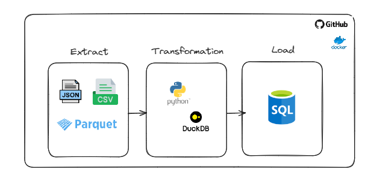
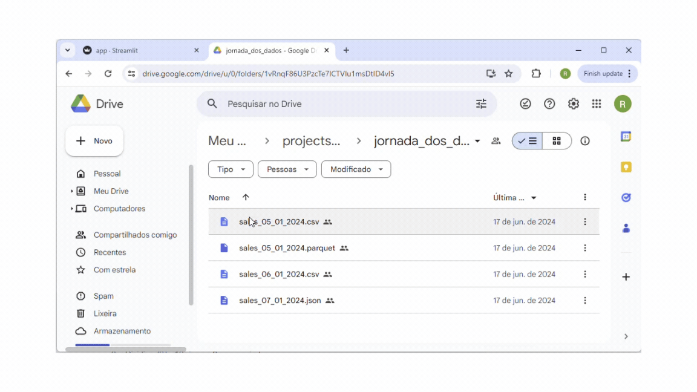

poetry add streamlit


streamlit run app.py

poetry add gdown
poetry add duckdb
poetry add psycopg2-binary
poetry add python-dotenv
poetry add sqlalchemy


# python-duckdb-etl
A simple ETL project.

Download files from a shared folder in Google Drive.
Read each file and transformed it.
Load the transformed data into a Postgresql hosted in render.com.




```bash
git clone https://github.com/robinsonlovatto/python-duckdb-etl.git
cd python-duckdb-etl
poetry shell
poetry install

# run the server
streamlit run app.py
```

## Starting the project from scratch
```bash
pyenv local 3.12.1   
poetry init    
poetry env use 3.12.1     
poetry shell     
poetry add gdown
poetry add duckdb
poetry add psycopg2-binary
poetry add python-dotenv
poetry add sqlalchemy 
poetry add streamlit
```

## Cloning the project
```bash
git clone https://github.com/robinsonlovatto/python-duckdb-etl.git
cd python-duckdb-etl
poetry shell
poetry install

# run the server
streamlit run app.py
```

## Building Docker image and running it on Docker
```bash
docker build -t my-python-image .
docker run -d -p 8501:8501 --name my-python-container my-python-image
```

## Front-end
```bash
http://localhost:8501/
```
